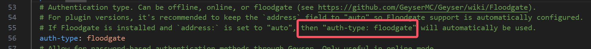

# 注意事项

## 使用提示

- 所有配置文件均为 JSON 格式，合并使用时请参考 [server.properties.json](./fastconfig/server.properties.json) 格式进行集成
- 一键配置机制说明：
  - 通过正则表达式检测目标文件内容：
    - 存在匹配项时（如 `server.properties` 中的 `online-mode=false`），"配置项修改"将显示该条目
    - **无匹配项时**该配置条目将不会显示
  - 正则匹配注意事项：
    - 单文件存在多个相同配置项时将无法正常显示
    - 处理 YAML 文件时需特别注意：
      - 需检查源文件是否存在重复配置项（包括注释内容）
      - 典型问题案例：Geyser 配置文件中注释导致的匹配失败

## 配置文件说明(非插件)

> JSON 文件不支持注释说明，故注意事项在此说明

### server.properties.json

本配置文件包含了 `server.properties` 和 `eula.txt` 的配置项。

- 版本兼容性：
  - 包含 1.7.10+ 主流版本的常用配置项
  - 不同 Minecraft 版本配置项可能存在差异

### leaves.json

配置文件路径：`leaves.yml`（服务端根目录）

- 暂无特殊注意事项

## 配置文件说明(插件)

### authme.json

配置文件路径：`plugins/AuthMe/config.yml`

- 数据库说明：
  - H2 数据库仅适用于 [AuthMeReReloaded](https://github.com/HaHaWTH/AuthMeReReloaded) 分支

### geyser.json

配置文件路径：`plugins/Geyser-Spigot/config.yml`

- 重要提示：
  - 必须删除配置文件第 55 行的注释（该注释会导致正则匹配失败）
  - 如图所示：
    

### viaversion.json

配置文件路径：`plugins/ViaVersion/config.yml`

- 暂无特殊注意事项
